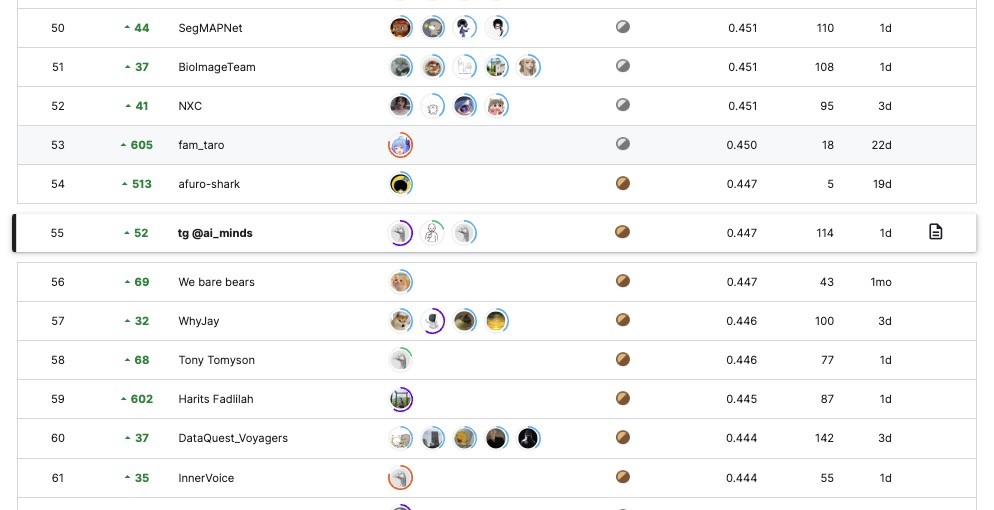

## Goal of the Competition
The goal of this competition is to segment instances of microvascular structures, including capillaries, arterioles, and venules. You'll create a model trained on 2D PAS-stained histology images from healthy human kidney tissue slides.
Your help in automating the segmentation of microvasculature structures will improve researchers' understanding of how the blood vessels are arranged in human tissues.

## Summary:
MultilabelStratifiedKFolds on dataset, source, num_cells with yolov8 on one class, drop unsure, TTA, WBF, dilation

Things that worked:
- Strong color augmentation
- MultilabelStratifiedKFolds
- Leave one out folds
- WBF + TTA

  
Things that not worked:
- Segment anything model
- Removing overlaps

Things that not tested:
- Pseudolabeling

### Best private (8th place): 0.552 without dilation and trained mostly on dataset 1
